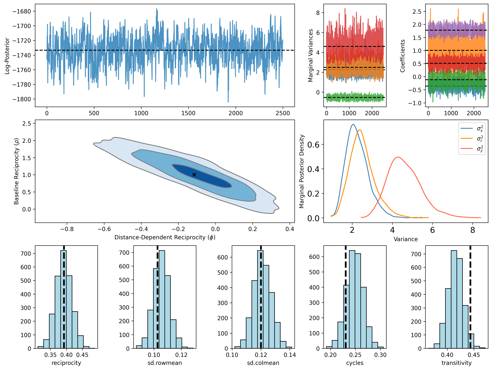
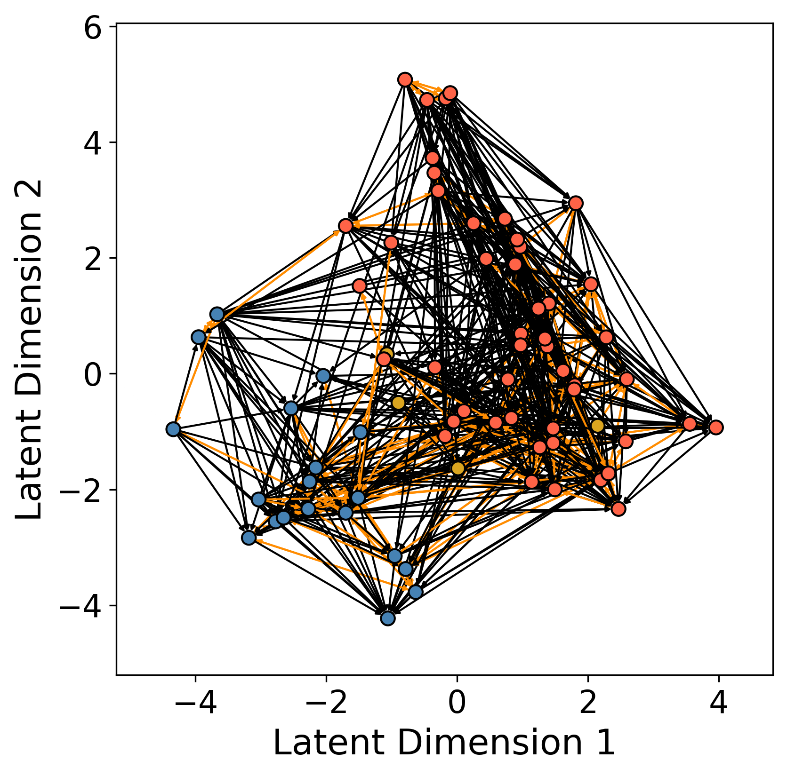

[](https://github.com/joshloyal/multidynet/blob/master/LICENSE)

## A Latent Space Approach to Inferring Distance-Dependent Reciprocity 

*Package Authors: [Joshua D. Loyal](https://joshloyal.github.io/) and Xiangyu Wu*

This package provides an interface for the model described in
"A Latent Space Approach to Inferring Distance-Dependent Reciprocity in Directed Networks." Inference is performed using
Hamiltonian Monte Carlo. For more details, see [Loyal et. al. (2024)](https://arxiv.org/abs/2411.18433).

Dependencies
------------
``rlsm`` requires:

- Python (>= 3.10)

and the requirements highlighted in [requirements.txt](requirements.txt). To install the requirements, run

```python
pip install -r requirements.txt
```

Installation
------------

You need a working installation of numpy, scipy, and jax to install ``rlsm``. Install these required dependencies before proceeding.  Use the following commands to get the copy from GitHub and install all the dependencies:

```
>>> git clone https://github.com/joshloyal/rlsm.git
>>> cd rlsm
>>> pip install -r requirements.txt
>>> python setup.py develop
```

Example
-------

```python
import matplotlib.pyplot as plt
import numpy as np

from rlsm import ReciprocityLSM
from rlsm.datasets import load_lawyers
from rlsm.covariates import dyad_cat_diff, dyad_nominal_diff


# load the Lazega lawyers's advice network
Y, features = load_lawyers()

# binary directed adjacency matrix
Y.shape
#>>> (71, 71)

# create a matrix of edge-wise covariates
X_dyad = np.dstack([
    dyad_cat_diff(features['female']),
    dyad_cat_diff(features['practice']),
])

X_dyad.shape
#>>> (71, 71, 2)

# initialize a distance-dependent LSM with d = 2 latent dimensions
# NOTE: reciprocity_type : str {'none', 'constant', 'distance'}
lsm = ReciprocityLSM(n_features=2, reciprocity_type='distance', random_state=42)

# run the MCMC algorithm for 2,500 warmup iterations and collect 2,500 post warmup samples
lsm.sample(Y, X_dyad=X_dyad, n_warmup=2500, n_samples=2500)

#>>> sample: 100%|█████████████████████████████████████████████████████████████████████████████| 5000/5000 [03:46<00:00, 22.07it/s, 63 steps of size 4.81e-02. acc. prob=0.85]

# summary of the posterior distribution
lsm.print_summary()

#>>> AUC: 0.938, AIC: 2968.120, BIC: 4643.712, DIC: 2826.027
#>>> 
#>>>                   mean       std    median      2.5%     97.5%     n_eff     r_hat
#>>> beta_dyad[0]      0.51      0.14      0.51      0.25      0.79   2173.26      1.00
#>>> beta_dyad[1]      1.78      0.13      1.78      1.51      2.01   1998.57      1.00
#>>>    dist_coef     -0.12      0.20     -0.10     -0.50      0.25    530.26      1.00
#>>>        r_var      2.50      0.63      2.43      1.36      3.75    398.81      1.00
#>>>   recip_coef      1.01      0.44      0.99      0.17      1.84    653.70      1.00
#>>>        s_var      2.26      0.55      2.19      1.29      3.36    601.05      1.00
#>>>      sr_corr     -0.53      0.20     -0.53     -0.92     -0.15    338.35      1.01
#>>>        z_var      4.60      0.83      4.51      3.06      6.22    772.34      1.00

# diagnostic plots
lsm.plot(figsize=(12, 9))
```



```python
# plot the observed network using the inferred latent positions
fig, ax = plt.subplots(figsize=(6, 6))

# create a networkx graph
g = nx.from_numpy_array(Y, create_using=nx.DiGraph)

# the posterior mean of the latent positions are stored in lsm.Z_
pos = {k : lsm.Z_[k] for k in range(Y.shape[0])}

# color code edges based on whether they are mutual or not
ecolor = ['darkorange' if Y[e[1], e[0]] else 'k' for e in list(nx.to_edgelist(g))]

# plot network embedding
colors = np.asarray(["tomato", "steelblue", "goldenrod"])
nx.draw_networkx(g, pos,
                 edgecolors='k',
                 node_color=colors[features['office'].values - 1],
                 edge_color=ecolor, width=1.0, with_labels=False,
                 arrowsize=5, node_size=50, ax=ax)
ax.tick_params(left=True, bottom=True, labelleft=True, labelbottom=True, labelsize=16)
ax.set_ylabel('Latent Dimension 2', fontsize=18)
ax.set_xlabel('Latent Dimension 1', fontsize=18)
```



Simulation Studies and Real-Data Applications
---------------------------------------------

The [scripts](scripts) directory includes the simulation studies and real-data application found in the article.
